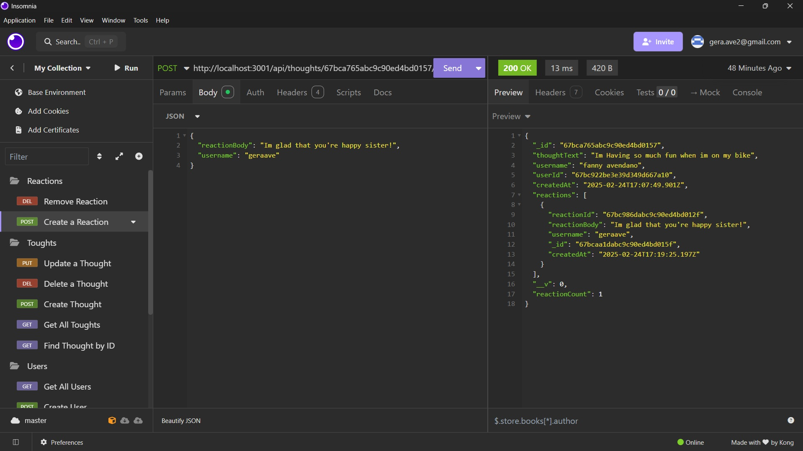

# Insomnia Social Network API

## Description
Base of a social network in insomnia

## Table of Contents
- [Installation](#installation)
- [Usage](#usage)
- [Contributing](#contributing)
- [Tests](#tests)
- [Notes](#notes)
- [License](#license)
- [Questions](#questions)

## Installation
cd .\SocialNetwork, npm i, npm run build, npm start

## Usage
create a social network whit the base specs

## Contributing
google my teachers

## Tests
Opening Insomnia and MongoDB Compass

## Notes

> [!NOTE]
> create a env file with the url  MONGODB_URI=mongodb://127.0.0.1:27017/socialNetworkDB

> [!IMPORTANT]

> 

> 

> [!WARNING]
> [Video Demostration](https://youtu.be/np0YEnCX6Dg)

> [!TIP]
> (https://youtu.be/np0YEnCX6Dg)

## License
This project is licensed under the MIT license.

## Questions
For any questions, reach out via GitHub: [sieke13](https://github.com/sieke13)  
Or send an email to: [gera.ave2@gmail.com]
